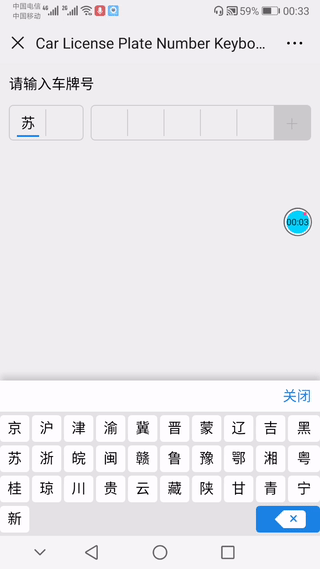

A vehicle license plate number keyboard




# Requirements

- Vue.js 2.x


# Quik Start

clone or download 

```shell
$ git clone git@github.com:yimocanxue/vue-car-plate-keyboard.git 
```

install dependencies

```shell
$ cd vue-car-plate-keyboard
$ npm install
```

run and open browser with `http://0.0.0.0:8080`

```shell
$ npm run dev
```


# Install

### NPM

```shell
$ npm install vue-car-plate-keyboard -D
```


# Usage

import first, then call Vue.use()  before new Vue instance

```javascript
import Vue from 'vue';
import VueCarPlateKeyboard from './lib/index';

Vue.config.productionTip = false;
Vue.use(VueCarPlateKeyboard);
new Vue({
    el: '#app',
    data: function () {
    },
    methods: {
        tapedKey (data) {
            console.log(data);
        },
        tapedBox (data) {
            console.log(data);
        },
        tapedDel (data) {
            console.log(data);
        },
        tapedOk (data) {
            console.log(data);
        } 
    }
})
```

use directive in HTML file

```html
<div id="app">
  <car-plate-keyboard 
      car-number="苏E55552学"
      active-color="#ff0000"
      ok-btn-text="关闭"
      v-on:tap-key="tapedKey"
      v-on:tap-box="tapedBox"
      v-on:tap-del="tapedDel"
      v-on:tap-ok="tapedOk"
   ></car-plate-keyboard>
</div>
```


### Props

| Props Name   | Type's | Default   | Description                                           |
| :----------- | ------ | --------- | ----------------------------------------------------- |
| car-number   | String | ''        | car plate number initial value                        |
| active-color | String | '#1a84e7' | input box active color，keyboard tap hover color etc. |
| ok-btn-text  | String | '确定'    | text of ok button                                     |


### Custom Events

| Event Name | Parameter                                               | Description                   |
| :--------- | ------------------------------------------------------- | ----------------------------- |
| tap-key    | {key: '5', keyIndex: 6, value: '苏E12345', valid: true} | emit when taped keyboard      |
| tap-box    | {keyIndex: 0, value: '苏', valid:  false}               | emit when taped input box     |
| tap-del    | {keyIndex: 6, value:  '苏E1234' , valid:  false}        | emit when taped delete button |
| tap-ok     | {value: '苏E12345', valid: true}                        | emit when taped ok button     |

keys of Paremeter means:

**key**:  current input character.

**keyIndex**: current edit(taped/input/delete) key index(from 0 to 7).

**value**: current car plate number.

**valid**： validity of current car plate number(true of false). 


# Contributions

Any contribution to the code (via pull request would be nice) or any part of the documentation and any idea and/or suggestion are very welcome.

> **Note** For any bug fix, the PR should be forked from the `master` branch. And for any suggestion or additional feature, the PR should be forked from the `develop` branch, where it can be integrated and rolled out in the next release.
>
> If you are not sure, please ask by openning a new issue.

However, please do not feel bad if your pull requests or contributions do not get merged or implemented into vue-car-plate-keyboard.

Your contributions can, not only help make vue-car-plate-keyboard better, but also push it away from what I intend to use it for. I just hope that you find it useful for your use or learn something useful from its source code. But remember, you can always fork it to make it work the way you want.


# License

vue-car-plate-keyboard is open-sourced software licensed under the MIT license.